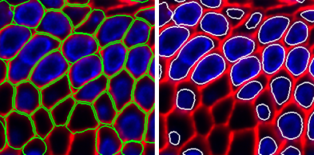
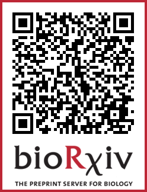

# UNSEG for Unsupervised Segmentation of Cells and Their Nuclei in Tissue Images

This is an implementation of [UNSEG](https://www.biorxiv.org/content/10.1101/2023.11.13.566842v1) on Python 3 with using  scikit-image, OpenCV, scikit-learn, and SciPy. The algorithm generates two mutually-consistent segmentation masks for cells and their nuclei in images of complex tissue samples. 



The repository includes:
* Source Python code of UNSEG.
* Jupyter notebook to demonstrate the nuclei and cell segmention pipeline.
* Zipped test RGB image of human gallbladder tissue, where the blue and red channels contain nucleus and cell membrane markers, respectively. Please extract "image.zip" before running the notebook.
* Requirements.txt

UNSEG parameters
* intensity : 3D (height, width, channels) numpy array.
        Intensities of nuclei marker (channel index = 0) and cell membrane marker (channel index = 1).
* area_threshold : int (positive).
        The minimal possible area of a nucleus in pixels.
* convexity_threshold : int (positive)
        The largest allowable deviation (in pixels) of a boundary point from its convex hull for a convex component.
* cell_marker_threshold : int (positive).
        Defines whether a cell membrane marker is present in a cluster of nuclei.
* dist_tr : string, one of "DT" or "GDT".
        Defines geometrical distance transform (DT) or gradient distance transform (GDT) in the Virtual Cuts.
* sigma0 : float (positive).
        The standard deviation of the Gaussian filter.
* k0 : float (positive).
        The degree of smoothing of the Gradient Adaptive Filter.
* r0 : int (positive).
        The disk kernel radius of the local Otsu method.
* pct : list of two positive floats, [float (positive), float (positive)].
        The background a priori probability thresholds for every of two channels.
* nk : list of positive integers, [int (positive), int (positive), ...].
        The list of kernel sizes in the Local Mean Suppression Filter.
* t0 : float (positive).
        The intensity threshold in the Local Mean Suppression Filter.
* ternary_met : string, one of "Argmax" or "Kmeans".
        Defines the algorithm to compute a posteriori local and global masks.
* visualization : bool.
        Plots a priori probabilities, a posteriori local and global masks, contrast based likelihood function, and nuclei and cell segmentations.
* area_ratio_threshold : float (positive).
        The area threshold for a cell without a nucleus.
* dilation_radius : int (positive).
        The nucleus mask is morphologically dilated by this amount for cells without cell membrane marker expression.

UNSEG outputs
* nuc_seg : 2D (height, width) numpy 'int32' array.
        Mask of segmented nuclei.
* cel_seg : 2D (height, width) numpy 'int32' array.
        Mask of segmented cells.
* n_nuclei : int.
        Number of segmented nuclei.
*n_cells : int.
        Number of segmented cells.


## Installation

To install the specified requirements in a Mamba environment, follow these steps:

1. **Create a new Mamba environment**:
   ```bash
   mamba create -n unseg python=3.9
   ```
   This will create a new environment named "my_env" with Python 3.8[^1][^3].

2. **Activate the environment**:
   ```bash
   mamba activate unseg
   ```
   Your command prompt should now show the active environment[^2].

3. **Install the required packages**:
   ```bash
   pip install opencv-python==4.7.0.72 numpy==1.24.3 matplotlib==3.7.1 scikit-image==0.20.0 scikit-learn==1.2.2 scipy==1.9.1
   ```
   This will install the specified versions of each package into your active environment[^1][^3][^5].

4. **Clone the repo**:
   ```bash
   git clone https://github.com/uttamLab/UNSEG.git
   cd UNSEG
   ```
5. **Run the notebook or the script**
   Open UNSEG folder in vscode. To execute notebook, open it and choose unseg env kernel.

---------

If you find UNSEG useful in your research, please consider citing:
```
@article {Kochetov2023.11.13.566842,
	author = {Bogdan Kochetov and Phoenix Bell and Paulo S Garcia and Akram S Shalaby and Rebecca Raphael and Benjamin Raymond and Brian J Leibowitz and Karen
Schoedel and Rhonda M Brand and Randall E Brand and Jian Yu and Lin Zhang and Brenda Diergaarde and Robert E Schoen and Aatur Singhi and Shikhar Uttam},
	title = {UNSEG: unsupervised segmentation of cells and their nuclei in complex tissue samples},
	elocation-id = {2023.11.13.566842},
	year = {2023},
	doi = {10.1101/2023.11.13.566842},
	publisher = {Cold Spring Harbor Laboratory},
	eprint = {https://www.biorxiv.org/content/early/2023/11/15/2023.11.13.566842.full.pdf},
	journal = {bioRxiv}
}
```


